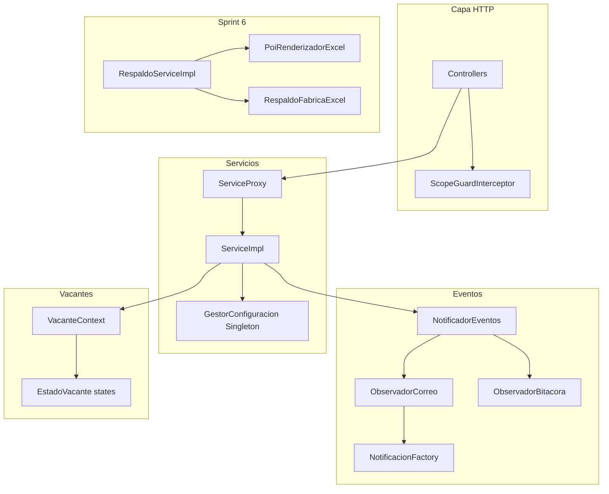

# Guía de patrones de diseño, SOLID y ramas — AVH Prácticas Backend

Documento de referencia del proyecto `practicas-backend`. La rama integrada más completa es **`EHS/sprint6-respaldo`** (Sprint 5 + 6). En **`develop`** faltan encuestas avanzadas, seguimiento, calificaciones y respaldo.

---

## 1. Mapa por rama (qué trae cada una)

| Rama | Módulos / funcionalidad | Patrones destacados |
|------|-------------------------|---------------------|
| `main` | Scaffold inicial | Solo carpetas vacías (`reporte/`, `decorator/`, `composite/`) |
| `origin/TCA-S0-singletons` | Experimentos S0 | Singleton: `GestorSesion`, `ConfigPrograma`, `GestorConfiguracion` |
| `origin/TC-observer` | Observer temprano | `shared.pattern.observer` (interfaces) |
| `origin/KBM/sprint1-plantillas-correo` | Correo | Factory Method: `correo.factory` |
| `origin/KBM/sprint1-3-modulos-base` | Base KBM | Factory + State vacantes |
| `origin/KBM/sprint3-vacantes` | Vacantes | State vacantes |
| `EHS/sprint2-estudiante-excel` | Estudiantes + Excel | **Adapter** `ImportadorExcelAdapter`, **Singleton** `GestorConfiguracion` |
| `EHS/sprint3-servicios-empresa` | Empresas + seguridad HTTP | **Proxy** `@ScopeGuard` + `ScopeGuardInterceptor` |
| `EHS/sprint4-PE-34-documentos-practica` | Documentos + integración | **Proxy** servicios, **Observer** `NotificadorEventos` |
| `develop` | Integración S0–S3 (+ parte S4) | Singleton, Proxy, Observer, State vacantes, Factory correo |
| `EHS/sprint5-seguimiento` | Tablero, bitácora, observaciones | Entidades seguimiento; tablero con umbral inactividad (sin Decorator) |
| `EHS/sprint5-calificaciones` | Notas por corte y final | Dominio calificaciones; usa `GestorConfiguracion` (nota máx. en S6) |
| `EHS/sprint5-encuestas` | Encuestas de cierre | **Factory Method** `NotificacionEncuestaFactory`, **Proxy** `EncuestaServiceProxy` |
| `EHS/sprint6-respaldo` | Todo S5 + respaldo Excel | **Bridge** + **Abstract Factory** en `reporte/backup/pattern/` |

### Pendiente en el repo (spec / imágenes del proyecto — típicamente KBM)

| Patrón / módulo | Estado en ramas EHS |
|-----------------|---------------------|
| Bridge `Reporte` / `Renderizador` (reportes admin) | `.gitkeep` en `reporte/bridge/` |
| Abstract Factory `FabricaExportacion` (xlsx/pdf reportes) | No implementado |
| Builder `DirectorReportes`, `InstanciaPracticaBuilder` | No (solo Lombok `@Builder` en entidades) |
| Decorator alertas (`AlertaDecorator`, etc.) | `.gitkeep` en `seguimiento/decorator/` |
| State `EstadoPractica` (práctica) | `EstadoPractica` es **enum**, no State GoF |
| `ReportController` + jobs async | Tabla `jobs_exportacion` (V8), sin Java |
| Facade / Mediator | No encontrados |

---

## 2. Patrones implementados (dónde y qué hace)

### 2.1 Singleton

| Archivo | Rama típica | Qué hace |
|---------|-------------|----------|
| `shared/pattern/singleton/GestorConfiguracion.java` | S2+ | Una instancia global con reglas de aptitud (`creditosMinimos`, `promedioMinimo`; en S6 también `maxNota`). |
| Uso: `estudiante/service/EstudianteServiceImpl.java` → `marcarApto()` | S2+ | Valida créditos y promedio antes de crear `InstanciaPractica`. |

```java
GestorConfiguracion config = GestorConfiguracion.getInstancia();
if (estudiante.getCreditosAprobados() < config.getCreditosMinimos()) { ... }
```

---

### 2.2 Proxy (dos capas)

**A) Proxy HTTP — control de acceso en controladores**

| Archivo | Qué hace |
|---------|----------|
| `shared/pattern/proxy/ScopeGuard.java` | Anotación con permiso requerido (ej. `ESTUDIANTE_LISTAR`). |
| `shared/pattern/proxy/ScopeGuardInterceptor.java` | Interceptor MVC: valida permiso antes del controller. |
| `shared/pattern/proxy/WebConfig.java` | Registra el interceptor. |

Usado en: `EstudianteController`, `EmpresaController`, `TutorEmpresarialController`, `ExpedienteController`.

**B) Proxy de servicio — autorización de negocio**

| Archivo | Implementa | Qué hace |
|---------|------------|----------|
| `EstudianteServiceProxy` | `EstudianteService` | `@Primary`: delega a `estudianteServiceImpl` tras `shared.security.ScopeGuard`. |
| `EmpresaServiceProxy` | `EmpresaService` | Filtra por scope del usuario. |
| `TutorEmpresarialServiceProxy` | `TutorEmpresarialService` | Idem. |
| `ProgramaServiceProxy` | `ProgramaService` | Idem. |
| `EncuestaServiceProxy` | `EncuestaService` | Delegación (S5 encuestas). |

Flujo: `Controller` → `*ServiceProxy` → validación scope → `*ServiceImpl`.

---

### 2.3 Observer (+ publicadores)

| Archivo | Rol |
|---------|-----|
| `shared/evento/Observador.java` | Interfaz observer. |
| `shared/evento/EventoSistema.java` | Payload del evento. |
| `shared/evento/TipoEventoSistema.java` | Tipos (vacante, docente, encuesta, etc.). |
| `shared/evento/NotificadorEventos.java` | **Sujeto**: notifica a todos los `Observador` inyectados. |
| `correo/service/ObservadorCorreo.java` | Envía correo vía factories. |
| `bitacora/service/ObservadorBitacora.java` | Escribe auditoría. |

**Quién publica:** `VacanteService`, `DocenteAsesorService`, `EncuestaServiceImpl`.

**Observer alternativo (entidades):** `shared/pattern/observer/` + `Estudiante`/`Empresa` como `Sujeto`; `EstudianteServiceImpl` registra observers en cambios de aptitud. La integración principal del sprint 4+ usa `NotificadorEventos`.

---

### 2.4 Factory Method + Template Method (correo)

| Archivo | Patrón | Qué hace |
|---------|--------|----------|
| `correo/factory/NotificacionFactory.java` | Template Method | `enviar()` llama `crearNotificacion()` y envía. |
| `NotificacionVacanteFactory`, `NotificacionDocenteFactory`, `NotificacionGenericaFactory`, `NotificacionEncuestaFactory` | Factory Method | Crean el `Notificacion` según el evento. |
| `ObservadorCorreo` | — | Elige la factory según `TipoEventoSistema`. |

**Factory Method adicional:** `EncuestaServiceImpl.crearEncuestaPendiente()` crea la entidad `Encuesta` y dispara notificación.

---

### 2.5 State (vacantes)

| Archivo | Qué hace |
|---------|----------|
| `vacante/state/EstadoVacante.java` | Interfaz de estado (aprobar, pausar, cerrar, cupos…). |
| `vacante/state/EstadoVacanteBase.java` | Comportamiento común. |
| `PendienteAprobacionState`, `ActivaState`, `PausadaState`, `CuposCompletosState`, `CerradaState`, `RechazadaState` | Estados concretos. |
| `vacante/state/VacanteContext.java` | **Contexto**: delega en el estado actual. |
| `vacante/service/VacanteService.java` | Instancia `VacanteContext` en cada transición. |

---

### 2.6 Adapter (importación Excel)

| Archivo | Qué hace |
|---------|----------|
| `estudiante/adapter/ImportadorEstudiantes.java` | Puerto/target. |
| `estudiante/adapter/ImportadorExcelAdapter.java` | Adapta Apache POI al puerto. |
| `EstudianteController` | `POST /estudiantes/importar` usa el adapter. |

---

### 2.7 Bridge + Abstract Factory (solo `EHS/sprint6-respaldo`)

| Archivo | Patrón | Qué hace |
|---------|--------|----------|
| `reporte/backup/pattern/bridge/RenderizadorExcel.java` | Abstracción Bridge | Operaciones de bajo nivel (hoja, fila, bytes). |
| `reporte/backup/pattern/bridge/PoiRenderizadorExcel.java` | Implementor | Apache POI. |
| `reporte/backup/pattern/abstractfactory/FabricaExcel.java` | Abstract Factory | Encabezados y datos por hoja. |
| `reporte/backup/pattern/abstractfactory/RespaldoFabricaExcel.java` | Concrete factory | Consultas JDBC por hoja. |
| `reporte/service/RespaldoServiceImpl.java` | — | Orquesta renderizador + fábrica para el respaldo. |

> No confundir con el Bridge de **reportes administrativos** (`Reporte` + `RenderizadorPdf/Excel`) de la spec PE-nuevo; ese aún no está en ramas EHS.

---

### 2.8 Specification (consultas dinámicas)

| Archivo | Qué hace |
|---------|----------|
| `estudiante/repository/EstudianteSpecification.java` | Filtros JPA Criteria para listados. |
| `empresa/repository/EmpresaSpecification.java` | Idem empresas. |
| `VacanteService` | `Specification<Vacante>` inline. |

---

### 2.9 Estrategia de envío de correo (polimorfismo)

| Interfaz | Implementaciones |
|----------|------------------|
| `correo/service/IMailService` | `SmtpMailService`, `StubMailService` |
| `auth/service/IMailService` | `MailServiceStub` (auth) |

`application-dev.yml`: `mail.mode: stub`.

---

## 3. Principios SOLID en el código

| Principio | Dónde se ve | Ejemplo concreto |
|-----------|-------------|------------------|
| **S** — Responsabilidad única | Paquetes por dominio (`estudiante`, `vacante`, `cierre`, `seguimiento`) | `CalificacionServiceImpl` solo califica; no envía correos. |
| **O** — Abierto/cerrado | State vacantes, factories de correo | Nuevo estado o `NotificacionXFactory` sin cambiar `VacanteContext` / `ObservadorCorreo` por completo. |
| **L** — Sustitución Liskov | `*ServiceProxy` implementan la misma interfaz que `*ServiceImpl` | Controller inyecta `EstudianteService`; puede ser proxy o impl. |
| **I** — Segregación de interfaces | Interfaces pequeñas | `ImportadorEstudiantes`, `FabricaExcel`, `IMailService`, `EstudianteService`. |
| **D** — Inversión de dependencias | Spring DI en controllers y servicios | `EncuestaController` → `EncuestaService` (proxy), no `new EncuestaServiceImpl()`. |

### Capas típicas

```
REST Controller  →  Service (Proxy @Primary)  →  ServiceImpl  →  Repository / JdbcTemplate
                      ↓
              ScopeGuard / @PreAuthorize
                      ↓
              NotificadorEventos → Observadores
```

---

## 4. Módulos Sprint 5 y 6 (tu trabajo EHS)

### Seguimiento (`EHS/sprint5-seguimiento`)

| Pieza | Ruta | Función |
|-------|------|---------|
| Controller | `seguimiento/controller/SeguimientoController.java` | API tablero, observaciones, avances, bitácora, alertas. |
| Service | `seguimiento/service/SeguimientoServiceImpl.java` | Lógica de cortes cerrados, `EN_ALERTA` en tablero, umbral desde `config_programas`. |
| Entidades | `ObservacionDocente`, `AvanceTutor`, `BitacoraEstudiante`, `AlertaSistema` | Persistencia. |
| Migración | `V16__sprint5_seguimiento_entities.sql` | Tablas seguimiento. |

No usa patrón Decorator; `AlertaSistema` solo se **consulta**, no se genera con `AlertaService`.

### Calificaciones (`EHS/sprint5-calificaciones`)

| Pieza | Ruta | Función |
|-------|------|---------|
| Controller | `calificacion/controller/CalificacionController.java` | Notas docente/tutor/final y resumen. |
| Service | `calificacion/service/CalificacionServiceImpl.java` | Reglas de negocio y validación de cortes. |
| Migración | `V17__sprint5_calificaciones_constraints.sql` | Constraints BD. |

### Encuestas (`EHS/sprint5-encuestas`)

| Pieza | Ruta | Función |
|-------|------|---------|
| Controller | `cierre/controller/EncuestaController.java` | Borrador, enviar, recordatorio. |
| Service | `cierre/service/EncuestaServiceImpl.java` | Factory Method al crear encuesta; publica eventos. |
| Factory | `correo/factory/NotificacionEncuestaFactory.java` | Correo de encuesta. |
| Proxy | `cierre/service/EncuestaServiceProxy.java` | Capa delegación. |
| Migración | `V18__sprint5_encuestas_schema.sql` | Tabla encuestas. |

### Respaldo (`EHS/sprint6-respaldo`)

| Pieza | Ruta | Función |
|-------|------|---------|
| Controller | `reporte/controller/RespaldoController.java` | `GET /respaldo/generar`. |
| Service | `reporte/service/RespaldoServiceImpl.java` | `@Async`, Bridge + Abstract Factory, bitácora. |

---

## 5. Diagrama de relaciones (patrones activos)



---

## 6. Cómo probar

1. Levantar PostgreSQL (puerto `5434` en dev) y la app: `mvn spring-boot:run -Dspring-boot.run.profiles=dev`
2. Importar en Postman: `postman/AVH-Practicas-Backend.postman_collection.json`
3. Ejecutar **Auth → Login** y guardar el token (script incluido).
4. Probar carpetas por módulo; carpetas **Sprint 5** y **Sprint 6** requieren rama `EHS/sprint6-respaldo` (o merges equivalentes).

---

## 7. Referencia rápida de endpoints

Ver colección Postman o la tabla en `postman/README.md` (generada junto a la colección).

Base URL por defecto: `http://localhost:8080` — JWT en header `Authorization: Bearer {{token}}`.
